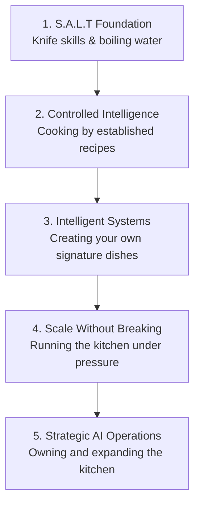
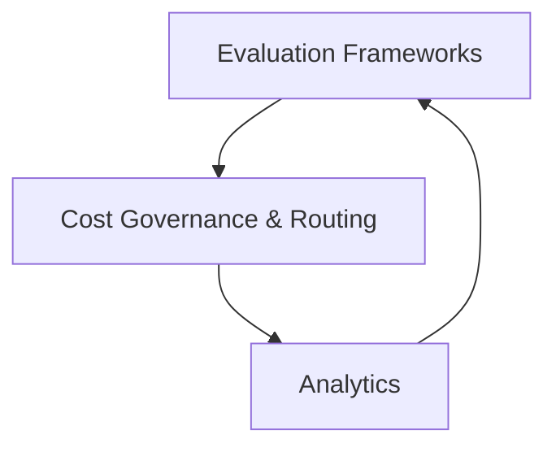

# 🧠 AI Engineer Road-Map

> Big Tech is paying **$350k+** for AI Engineers in 2026. Most people chase flashy models for months before they ever build a real foundation — this roadmap is the foundation-first alternative.

**AI Engineering = Software Engineering + Intelligent Models.**
Software engineers cook the dish. AI engineers add the flavoring and the garnish on top. You can't enhance a system you don't understand — and you can't season a dish you don't know how to cook.

---

## 📋 Table of Contents

- [Why This Exists](#-why-this-exists)
- [The 5-Layer Architecture](#-the-5-layer-architecture)
- [Layer 1 — The S.A.L.T Foundation](#1-the-salt-foundation)
- [Layer 2 — Controlled Intelligence](#2-controlled-intelligence-via-pretrained-models)
- [Layer 3 — Architecting Intelligent Systems](#3-architecting-intelligent-systems)
- [Layer 4 — Scale Without Breaking](#4-scale-without-breaking)
- [Layer 5 — Strategic AI Operations (LLMOps)](#5-strategic-ai-operations-llmops)
- [The Mastery Matrix](#-the-ai-engineer-mastery-matrix)
- [Choose Your Track](#-targeted-learning-tracks)
- [Contributing](#-contributing)

---

## 🎯 Why This Exists

The problem: most people waste months chasing flashy machine-learning models before building a real foundation. That's like trying to cook before you know how to hold a knife.

This roadmap fixes that by forcing foundation-first sequencing — five layers, in order, no skipping ahead.

---

## 🏗 The 5-Layer Architecture

| # | Layer | Culinary Metaphor |
|---|-------|--------------------|
| 1 | The S.A.L.T Foundation | Learning knife skills & boiling water |
| 2 | Controlled Intelligence | Cooking by following established recipes |
| 3 | Intelligent Systems | Creating your own signature dishes |
| 4 | Scale Without Breaking | Running the kitchen under pressure |
| 5 | Strategic AI Operations | Owning and expanding the kitchen |

---

## 1. The S.A.L.T Foundation

**S.A.L.T** = the four non-negotiables before you touch a model.

1. **S**oftware fluency — Python
2. **A**PI architecture — endpoints, request/response design
3. **L**ifecycle & version control — Git / GitHub
4. **T**ech stack — MongoDB, Flask/Node, React

---

## 2. Controlled Intelligence via Pretrained Models

Now is not the time to invent new recipes. Learn the art of AI by using what already works — don't train from scratch. Get fluent with pretrained model APIs (OpenAI, Anthropic, Hugging Face) before you build anything custom.

---

## 3. Architecting Intelligent Systems

| Concept | What it does | Example |
|---|---|---|
| **LangGraph** | Multi-step logic and dynamic routing. Instead of a back-and-forth chat, you engineer a system. | A research assistant that retrieves articles, summarizes them, and critiques its own output. |
| **Vector Databases** | Smart semantic data storage. | Storing embeddings for fast similarity search. |
| **MCP** | Defines system boundaries and rules — the rulebook. Defines what tools the model can use, what inputs are expected, and what outputs return. Prevents the AI from sending random formats to random places. | Locking down exact Shopify lookups and Slack messages. |
| **RAG** | Contextual intelligence retrieval — giving the AI an open-book exam. | See the 5-step pipeline below. |

**The RAG pipeline:**
1. **Chunking** — break private documents down
2. **Embedding** — convert text to numbers to compare semantic meaning
3. **Vector DB storage** — store the embeddings
4. **Retrieval & Augmentation** — find relevant chunks, inject into the prompt
5. **Generation** — output highly accurate answers using real company data

---

## 4. Scale Without Breaking

**Mindset shift:** designing the dish is over. Now you're running the entire kitchen while customers order non-stop. A workflow that works perfectly on your local machine is useless if it shatters under scale — it has to work flawlessly under pressure.

**The toolkit for high-volume operations:**

| Tool | Metaphor | What it does |
|---|---|---|
| **Docker** | Packing orders | Wraps code and dependencies into a sealed container. Runs identically on a laptop and in the cloud. |
| **AWS / GCP** | Franchising | Turns local experiments into a globally accessible product — home kitchen to serving 5,000. |
| **Redis caching** | Salt on the counter | Stores answers to frequent questions to avoid costly repeat LLM calls. Keeps heavily-used responses instantly accessible. |

---

## 5. Strategic AI Operations (LLMOps)

**Mindset shift:** owning the restaurant. You're no longer in the kitchen coding individual features — you're looking at the holistic system from above. The goal is sustainable business value, not just technical novelty.

### The LLMOps Triad

- **A. Evaluation frameworks** *(e.g. DeepEval)* — the food critics. Continuously testing pipelines for hallucinations, consistency, and answer accuracy across chunking strategies.
- **B. Cost governance & routing** — the chef's ingredient choices. Strategically routing simple tasks to cheaper models (e.g. Claude Sonnet) and heavy reasoning tasks to premium models (e.g. Claude Opus) to prevent cost explosions.
- **C. Analytics** *(e.g. PostHog, Amplitude)* — tracking the customer journey. Knowing exactly where users drop off and which AI features actually get used.

---

## 📊 The AI Engineer Mastery Matrix

| Layer | Culinary Metaphor | Core Mindset | Essential Tech Stack |
|---|---|---|---|
| 1 | S.A.L.T Foundation | Knife Skills & Boiling Water | Python, Git & GitHub, Endpoints, MongoDB |
| 2 | Controlled Intelligence | Following Recipes | OpenAI APIs, Hugging Face, Anthropic APIs |
| 3 | Intelligent Systems | Signature Dishes | LangGraph, MCP, Vector DBs, RAG |
| 4 | Scale Without Breaking | Running the Kitchen | Docker, AWS/GCP, Redis |
| 5 | Strategic Operations | Owning the Restaurant | DeepEval, PostHog, Cost Routing |

---

## 🎯 Targeted Learning Tracks

**Path 1 — Fundamentals Track** *(Absolute beginners)*
`No-Code AI` → `Prompt Engineering` → `Generative AI Applications`

**Path 2 — The Data Scientist Track** *(Data professionals working with foundation models)*
`ML Fundamentals` → `Deep Learning` → `Explainable AI`

**Path 3 — The Developer Track** *(Existing software engineers)*
`OpenAI APIs` → `LangChain` → `Vector Databases` → `LLMOps`

---

---

# Don't Overcomplicate the Process
## AI Engineer is a Software Engineer First. Build your Python and Software Foundations Before Chasing Flashy models. Start Mastering the Knife.

---

## 🤝 Contributing

Found a gap, a broken link, or want to add resources to a layer? PRs and issues are welcome — see [CONTRIBUTING.md](CONTRIBUTING.md).

If this roadmap helped you, a ⭐ star helps other people find it too.

## 📄 License

[MIT](LICENSE)
