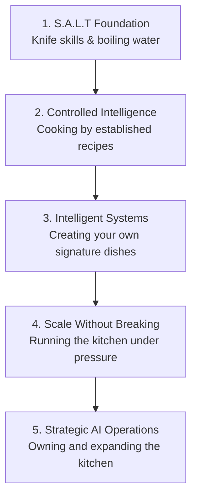
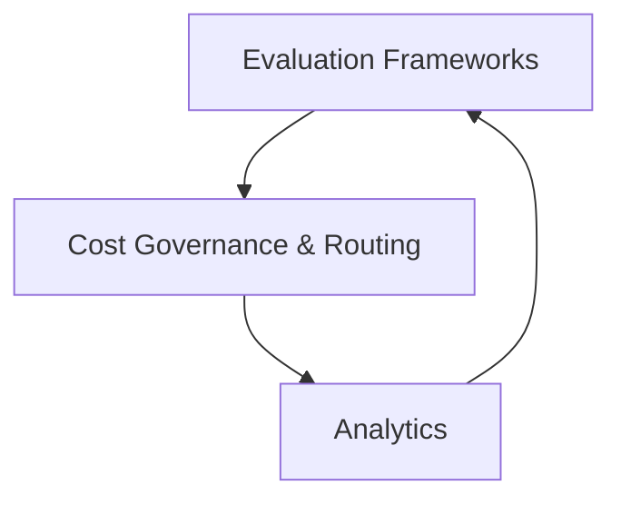

# 🧠 AI Engineer Road-Map

> Big Tech is paying **$350k+** for AI Engineers in 2026. Most people chase flashy models for months before they ever build a real foundation — this roadmap is the foundation-first alternative.

**AI Engineering = Software Engineering + Intelligent Models.**
Software engineers cook the dish. AI engineers add the flavoring and the garnish on top. You can't enhance a system you don't understand — and you can't season a dish you don't know how to cook.
*— THEREAL_RINAZ*

---

## 📋 Table of Contents

- [Why This Exists](#-why-this-exists)
- [The 5-Layer Architecture](#-the-5-layer-architecture)
- [Layer 1 — The S.A.L.T Foundation](#1-the-salt-foundation)
- [Layer 2 — Controlled Intelligence](#2-controlled-intelligence-via-pretrained-models)
- [Layer 3 — Architecting Intelligent Systems](#3-architecting-intelligent-systems)
- [Layer 4 — Scale Without Breaking](#4-scale-without-breaking)
- [Layer 5 — Strategic AI Operations (LLMOps)](#5-strategic-ai-operations-llmops)
- [AI Engineering Best Practices](#-ai-engineering-best-practices)
- [The Mastery Matrix](#-the-ai-engineer-mastery-matrix)
- [Choose Your Track](#-targeted-learning-tracks)
- [Certifications Roadmap](#-certifications-roadmap)
- [Capstone Project Ideas & Portfolio](#-capstone-project-ideas--portfolio)
- [What Companies Actually Expect](#-what-companies-actually-expect)
- [Interview Preparation](#-interview-preparation)
- [A Realistic Timeline](#-a-realistic-timeline)
- [Learning Resources](#-learning-resources)
- [Contributing](#-contributing)
- [Author](#️-author)

---

## 🎯 Why This Exists

The problem: most people waste months chasing flashy machine-learning models before building a real foundation. That's like trying to cook before you know how to hold a knife.

If your goal is genuinely **"become an AI Engineer who can immediately contribute in a company without struggling after getting hired,"** your roadmap can't be *"learn Python → learn ML → get a job."* That sequence produces candidates who can pass tutorials but struggle with real engineering work. You need the same skill stack companies actually expect from junior-to-mid-level AI engineers — not just model literacy.

This roadmap fixes that by forcing foundation-first sequencing — five layers, in order, no skipping ahead.

*— THEREAL_RINAZ*

---

## 🏗 The 5-Layer Architecture

| # | Layer | Culinary Metaphor |
|---|-------|--------------------|
| 1 | The S.A.L.T Foundation | Learning knife skills & boiling water |
| 2 | Controlled Intelligence | Cooking by following established recipes |
| 3 | Intelligent Systems | Creating your own signature dishes |
| 4 | Scale Without Breaking | Running the kitchen under pressure |
| 5 | Strategic AI Operations | Owning and expanding the kitchen |

---

## 1. The S.A.L.T Foundation

**S.A.L.T** = the four non-negotiables before you touch a model.

1. **S**oftware fluency — Python
2. **A**PI architecture — endpoints, request/response design
3. **L**ifecycle & version control — Git / GitHub
4. **T**ech stack — MongoDB, Flask/Node, React

**Two more prerequisites before you leave the foundation:**

- **SQL** — you can't season data you can't query. `SELECT`, `JOIN`s, `GROUP BY`, window functions, CTEs, query optimization.
- **Math for AI** — the minimum, not the maximum.
  - **Linear Algebra** — Matrix, Vector, Eigenvalues (this is what PCA and embeddings run on)
  - **Calculus** — Gradient, Derivatives, Chain Rule (just enough to understand *why* gradient descent and backpropagation work)
  - **Probability** — Bayes, Distribution, Variance, Standard Deviation
  - **Statistics** — Mean, Median, Correlation, Hypothesis Testing

### 1.1 Python Fluency — In Depth

Master Python before touching AI. Topics: Variables, Data Types, Loops, Functions, OOP, Modules, Packages, Exceptions, Decorators, Generators, Iterators, Context Managers, Typing, Dataclasses, File Handling, JSON, CSV, Logging, Virtual Environment, Pip, Poetry, UV, Async Programming, Multithreading, Multiprocessing.

**Projects:** Banking System · Todo CLI · File Organizer · Password Manager · API Client · Web Scraper

### 1.2 Computer Science Fundamentals

Don't skip CS — it's what separates engineers from tutorial-followers.

- **DSA:** Arrays, Linked List, Stack, Queue, Tree, Heap, Trie, Graph, Hash Table
- **Algorithms:** Sorting, Searching, DFS, BFS, Dynamic Programming, Greedy, Binary Search
- **Operating Systems:** Process, Thread, Memory, CPU Scheduling, Deadlock, Mutex, Semaphore
- **Networking:** HTTP, HTTPS, DNS, TCP, UDP, REST, WebSocket
- **Databases:**
  - SQL — Joins, Index, Transactions, ACID, Query Optimization
  - NoSQL — MongoDB, Redis

### 1.3 Software Engineering Practices

This is where many AI learners fall behind — knowing a model means nothing if you can't ship and maintain code as part of a team.

Git, GitHub, Git Flow, Branching, Merge, Pull Request, Code Review, Clean Code, SOLID, Design Patterns, Testing, Debugging, CI/CD basics, Documentation.

**Projects:** Team project · Open Source Contribution

### 1.4 Data Engineering

Before models, you need clean, well-shaped data: Pandas, NumPy, Polars, Data Cleaning, Feature Engineering, Data Pipelines, ETL, Apache Spark (Basics).

**Projects:** Customer Analytics · Sales Dashboard · Data Pipeline

---

## 2. Controlled Intelligence via Pretrained Models

Now is not the time to invent new recipes. Learn the art of AI by using what already works — don't train from scratch. Get fluent with pretrained model APIs (OpenAI, Anthropic, Hugging Face) before you build anything custom.

**The established recipes worth knowing:**

- **Classical ML algorithms** — Supervised (Regression, Classification): Linear Regression, Logistic Regression, SVM, Decision Tree, Random Forest, XGBoost, LightGBM. Unsupervised: KMeans, PCA, DBSCAN. These are recipes too — proven, well-understood, and often the right tool before you reach for an LLM.
- **How to judge a recipe (evaluation metrics)** — Precision, Recall, F1, ROC/AUC, Cross Validation for classification; MSE/RMSE/R² for regression; Silhouette score for clustering. If you can't measure it, you can't improve it.
  - **ML Projects:** House Price Prediction · Credit Risk · Fraud Detection · Churn Prediction
- **Deep learning architecture literacy** — you don't need to build a CNN, RNN, GAN, or Transformer from scratch, but you should recognize what's running inside the pretrained model you're calling. You can't season a dish made with an ingredient you can't identify.
  - **Framework:** PyTorch
  - **Concepts:** Tensor, Autograd, Backpropagation, CNN, RNN, LSTM, Transformer, Attention
  - **Deep Learning Projects:** Image Classification · OCR · Sentiment Analysis · Text Classification
- **NLP** — Tokenization, Embedding, Word2Vec, FastText, BERT, RoBERTa, T5. **Projects:** Chatbot · Resume Parser · Document Search
- **Computer Vision** — OpenCV, YOLO, Detection, Segmentation. **Projects:** Face Recognition · Object Detection · Parking Detection
- **Fine-tuning** — LoRA and QLoRA. This is still "using the recipe," just adapting it to your ingredients — a lighter-weight alternative to training from scratch.

---

## 3. Architecting Intelligent Systems

| Concept | What it does | Example |
|---|---|---|
| **LangGraph** | Multi-step logic and dynamic routing. Instead of a back-and-forth chat, you engineer a system. | A research assistant that retrieves articles, summarizes them, and critiques its own output. |
| **Vector Databases** | Smart semantic data storage. | Storing embeddings for fast similarity search. |
| **MCP** | Defines system boundaries and rules — the rulebook. Defines what tools the model can use, what inputs are expected, and what outputs return. Prevents the AI from sending random formats to random places. | Locking down exact Shopify lookups and Slack messages. |
| **RAG** | Contextual intelligence retrieval — giving the AI an open-book exam. | See the 5-step pipeline below. |

**The RAG pipeline:**
1. **Chunking** — break private documents down
2. **Embedding** — convert text to numbers to compare semantic meaning
3. **Vector DB storage** — store the embeddings
4. **Retrieval & Augmentation** — find relevant chunks, inject into the prompt
5. **Generation** — output highly accurate answers using real company data

**AI Agents, in depth:** LangGraph gives you the *how* — agents are the *what*. An agent needs four things to act on its own: **tool calling** (deciding when and how to use an external function), **memory** (short-term context vs. persisted state across sessions), **planning** (breaking a goal into steps), and, once one agent isn't enough, **multi-agent orchestration** (specialized agents handing off work to each other). Frameworks to know: LangGraph, LangChain, LlamaIndex, DSPy, Haystack, and the OpenAI Agents SDK.

**Layer 3 Projects:** PDF Chatbot · AI Assistant · Customer Support Agent · Coding Assistant · Research Agent

---

## 4. Scale Without Breaking

**Mindset shift:** designing the dish is over. Now you're running the entire kitchen while customers order non-stop. A workflow that works perfectly on your local machine is useless if it shatters under scale — it has to work flawlessly under pressure.

**The toolkit for high-volume operations:**

| Tool | Metaphor | What it does |
|---|---|---|
| **Docker** | Packing orders | Wraps code and dependencies into a sealed container. Runs identically on a laptop and in the cloud. |
| **AWS / GCP / Azure** | Franchising | Turns local experiments into a globally accessible product — home kitchen to serving 5,000. Pick one cloud: Compute, Storage, IAM, Serverless, GPU Instances, AI Services. |
| **Redis caching** | Salt on the counter | Stores answers to frequent questions to avoid costly repeat LLM calls. Keeps heavily-used responses instantly accessible. |

### 4.1 MLOps

MLflow, Docker, Kubernetes (Basics), FastAPI, Model Registry, Model Monitoring, Airflow, Feature Store, DVC.

**Deploy Projects:** ML Model API · LLM API · Recommendation API

### 4.2 Backend Development

FastAPI, Authentication, JWT, OAuth, REST API, WebSocket, Async, Background Tasks.

**Projects:** AI SaaS Backend · AI API Service

### 4.3 Frontend — Enough to Ship Products

HTML, CSS, JavaScript, TypeScript, React, Next.js.

**Projects:** AI Dashboard · Chat Interface · Analytics Dashboard

### 4.4 System Design

Scalability, Load Balancer, Caching, Queue, CDN, Database Design, Vector Search, Distributed Systems.

---

## 5. Strategic AI Operations (LLMOps)

**Mindset shift:** owning the restaurant. You're no longer in the kitchen coding individual features — you're looking at the holistic system from above. The goal is sustainable business value, not just technical novelty.

### The LLMOps Triad

- **A. Evaluation frameworks** *(e.g. DeepEval, LangSmith, Promptfoo, Phoenix, Weights & Biases)* — the food critics. Continuously testing pipelines for hallucinations, consistency, and answer accuracy across chunking strategies. Also covers prompt management, prompt versioning, and hallucination detection. Pair this with **observability and safety tooling**: Langfuse for tracing every step of a chain, Sentry for catching production errors, and guardrails to keep the system inside its rules — the difference between a kitchen that's being watched and one that's flying blind.
- **B. Cost governance & routing** — the chef's ingredient choices. Strategically routing simple tasks to cheaper models (e.g. Claude Sonnet) and heavy reasoning tasks to premium models (e.g. Claude Opus) to prevent cost explosions. Includes caching to cut redundant calls.
- **C. Analytics** *(e.g. PostHog, Amplitude)* — tracking the customer journey. Knowing exactly where users drop off and which AI features actually get used.

### 5.1 Production AI

Running the restaurant means the lights can't go out mid-service: Monitoring, Logging, Tracing, Retry, Rate Limit, Security, Secrets, API Gateway.

---

## ✅ AI Engineering Best Practices

Cross-cutting practices that apply across every layer once you're operating at production scale:

Testing AI systems, Prompt evaluation, Model versioning, Dataset versioning, Feature flags, Cost monitoring, Latency optimization, Human-in-the-loop workflows, Responsible AI, Privacy and security.

---

## 📊 The AI Engineer Mastery Matrix

| Layer | Culinary Metaphor | Core Mindset | Essential Tech Stack |
|---|---|---|---|
| 1 | S.A.L.T Foundation | Knife Skills & Boiling Water | Python, DSA, OS, Networking, Git & GitHub, Clean Code/SOLID, Endpoints, MongoDB, SQL, Math for AI |
| 2 | Controlled Intelligence | Following Recipes | OpenAI APIs, Hugging Face, Anthropic APIs, Classical ML, PyTorch/Deep Learning, NLP, Computer Vision, LoRA/QLoRA |
| 3 | Intelligent Systems | Signature Dishes | LangGraph, LangChain, LlamaIndex, DSPy, MCP, Vector DBs, RAG, AI Agents |
| 4 | Scale Without Breaking | Running the Kitchen | Docker, Kubernetes, AWS/GCP/Azure, Redis, FastAPI, MLflow, React/Next.js, System Design |
| 5 | Strategic Operations | Owning the Restaurant | DeepEval, LangSmith, Langfuse, Sentry, PostHog, Cost Routing, Production Monitoring |

---

## 🎯 Targeted Learning Tracks

**Path 1 — Fundamentals Track** *(Absolute beginners)*
`No-Code AI` → `Prompt Engineering` → `Generative AI Applications`

**Path 2 — The Data Scientist Track** *(Data professionals working with foundation models)*
`ML Fundamentals` → `Deep Learning` → `Explainable AI`

**Path 3 — The Developer Track** *(Existing software engineers)*
`OpenAI APIs` → `LangChain` → `Vector Databases` → `LLMOps`

---

## 🏆 Certifications Roadmap

Certifications aren't the goal, but they force structured coverage and signal credibility to employers. A sensible sequence:

| Order | Certification | Covers |
|---|---|---|
| 1 | **Azure AI-900** *(Fundamentals)* | AI/ML basics, Azure AI services, ethical AI — a good on-ramp |
| 2 | **AWS ML Specialty** *(Professional)* | Data prep, EDA, modeling, SageMaker deployment |
| 3 | **Azure AI-102** *(Associate)* | Designing AI solutions on Azure, Cognitive Services |
| 4 | **GCP ML Engineer** *(Professional)* | ML on Google Cloud, Vertex AI, BigQuery ML |
| 5 | **TensorFlow Developer** *(Specialist, optional)* | Deep learning, CNNs, NLP with TensorFlow/Keras |

Pick one cloud to go deep on rather than collecting all three — know the other two at a conversational level.

---

## 🛠 Capstone Project Ideas & Portfolio

Projects prove the roadmap stuck. One project per layer, roughly in this order:

1. **Personal research assistant CLI** — Layer 1/2: a script that calls an LLM API to retrieve and summarize.
2. **Docs Q&A backend** — Layer 3: FastAPI + a vector DB, a real RAG pipeline behind an endpoint.
3. **Customer support / sentiment bot** — Layer 3: classification or NLP task wired into a chat interface.
4. **Production-ready version of the Docs Q&A bot** — Layer 4/5: add Langfuse tracing, Sentry monitoring, and safety guardrails to project #2.
5. **End-to-end deployed pipeline** — Layer 4/5: Docker, CI/CD, cloud hosting (AWS/GCP/Azure), with monitoring dashboards — the capstone that ties every layer together.

### Full Portfolio Progression

Build **10–15 production-quality projects**, not dozens of small tutorials:

1. CLI Productivity Tool
2. REST API with FastAPI
3. Data Analysis Dashboard
4. ML Prediction Service
5. Computer Vision Application
6. NLP Document Analyzer
7. RAG Chatbot
8. Multi-Agent AI System
9. AI SaaS Product
10. End-to-End MLOps Pipeline
11. LLM Evaluation Platform
12. AI Automation Workflow

**Each project should include:**

- ✅ Clean architecture
- ✅ Tests
- ✅ Docker support
- ✅ CI/CD pipeline
- ✅ Documentation
- ✅ Live deployment
- ✅ GitHub README with architecture diagrams
- ✅ Screenshots or demo video

---

## 🎯 What Companies Actually Expect

By the time you're job-ready, you should be able to:

- ✅ Build an AI application from scratch.
- ✅ Train, evaluate, and improve ML/DL models.
- ✅ Integrate LLMs with tools, APIs, and vector databases.
- ✅ Design and consume REST APIs.
- ✅ Use Git in a collaborative workflow.
- ✅ Write maintainable, tested Python code.
- ✅ Containerize applications with Docker.
- ✅ Deploy AI services to the cloud.
- ✅ Monitor, debug, and optimize production systems.
- ✅ Read technical documentation and quickly learn unfamiliar libraries.

---

## 🎤 Interview Preparation

Practice: Python coding · DSA (100–200 quality problems) · SQL · ML theory · Deep Learning concepts · LLM architecture · System Design · API design · Debugging exercises · Behavioral interviews · Code reviews · Pair programming.

---

## ⏱ A Realistic Timeline

| Phase | Duration |
|---|---|
| Foundation + Python + CS | 3–4 months |
| Software Engineering + Math + Data | 2–3 months |
| ML + Deep Learning | 3–4 months |
| Generative AI + LLMOps + MLOps | 3–4 months |
| Cloud + System Design + Portfolio + Interviews | 2–3 months |

**Total:** ~**12–18 months** of focused, consistent work. Highly motivated learners with substantial weekly commitment may progress faster, but reaching production-level competence typically requires building and deploying multiple real projects — not just completing courses.

---

## 🚀 Our Commitment

Don't worry about finding the right resources or deciding what to study next.

For **every topic** in this roadmap, we'll provide:
- 📖 Deep conceptual understanding (not just theory)
- 🧠 Beginner → Advanced explanations
- 💻 Hands-on coding examples
- 🛠️ Real-world projects
- 🎯 Practice exercises & challenges
- ❓ Interview-focused questions
- 📚 Curated learning resources
- 📝 Notes, cheat sheets & summaries
- ⚡ Best practices & common mistakes
- 🔥 Industry insights and production-level guidance

Just follow this roadmap step by step. Focus on learning, building, and staying consistent—we'll guide you through every stage.

> **Remember:** You don't need hundreds of resources. You need one clear path and consistent execution. Follow this roadmap, trust the process, and master each topic before moving to the next.

**— THEREAL_RINAZ**

---

## 🤝 Contributing

Found a gap, a broken link, or want to add resources to a layer? PRs and issues are welcome — see [CONTRIBUTING.md](CONTRIBUTING.md).

If this roadmap helped you, a ⭐ star helps other people find it too.

*— THEREAL_RINAZ*

## ✍️ Author

**THEREAL_RINAZ**
## 👨‍💻 Connect with Me

*— THEREAL_RINAZ*

---

## 📄 License

[MIT](LICENSE)
